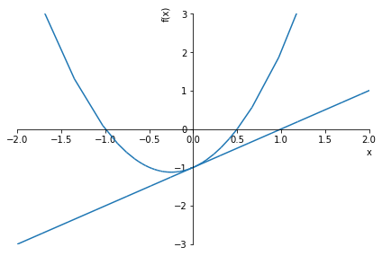
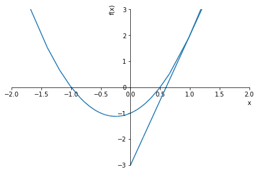
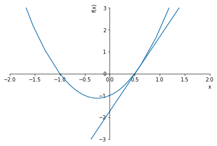
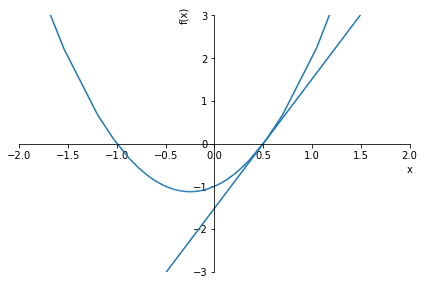
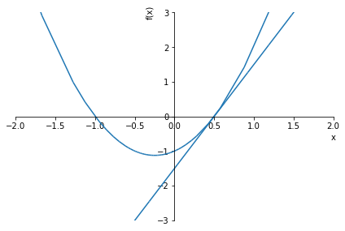
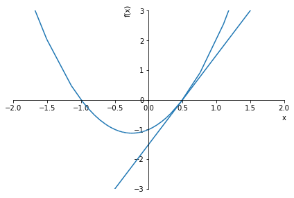
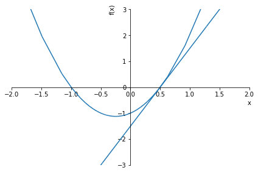

# **방정식의 실근의 어림값 구하기**
30925 전은지😀

# **원리**📚

곡선 y = f(x) 위의 적당한 점 (x1,f(x1))에서의 접선의 방정식은  
y = f'(x1)(x - x1) + f(x1) 입니다.  
y = f'(x1)x - f'(x1)x1 + f(x1) 이므로 y자리에 0을 넣고 정리하면  
x = x1 - f(x1)/f'(x1) 입니다. 여기에서 x는 x절편이 됩니다.  
위 x를 x2로 설정하고 이 과정을 반복하면 xn이 점점 방정식의 해에 가까워지게 됩니다.

그런데 만약 f'(xn)이 0이 나온다면 식을 계산할 수 없을 것입니다.  
이를 방지하기 위해 기울기가 0이 나오면 - f(xn-1)/f'(xn-1)만큼 다시 이동시켜서 계산을 하도록 하였습니다.  
(xn-1은 이전의 x의 위치)  
만약 f'(x1)이 0이라면 x1값에 1을 더해주었습니다.


```python
from sympy import *
%matplotlib inline

init_printing()
```


```python
def solve_equation(f, epoch = 10, t = 0, graph = False, xlim = (0,0), ylim = (0,0)) :
    x = Symbol('x')
    f_diff = diff(f, x)
    move = 0
    
    for i in range(epoch) :
        if (f_diff.subs(x,t) == 0) :
            if (move == 0) :
                move += 1
            t += move
            continue
        
        if (graph) :
            line = expand(f_diff.subs(x,t)*(x-t) + f.subs(x,t))
            plot(f,line, xlim=xlim, ylim=ylim)
        
        move = - f.subs(x,t)/f_diff.subs(x,t)
        t += move
        
        if (f.subs(x,t) == 0) :
            break
        print(N(t))
        
    print("근의 근사값은", N(t))
    real = [N(m) for m in solve(f)]
    print("실제 근은", real)
```

# **실습**🐥
이제는 여러가지 함수의 근의 근사값을 구해보고 파이썬 내장함수를 이용해서 구하는 실제 근과 비교해볼 것입니다.  
실제 근에는 복소수도 포함되지만 근사값은 실수만 나오니까 참고해주세요!

### **다항함수 근 구하기**  
2x^2 + x -1 = 0


```python
solve_equation(2*x**2 + x - 1)
```

    1.00000000000000
    0.600000000000000
    0.505882352941176
    0.500022888532845
    0.500000000349246
    0.500000000000000
    0.500000000000000
    0.500000000000000
    0.500000000000000
    0.500000000000000
    근의 근사값은 0.500000000000000
    실제 근은 [-1.00000000000000, 0.500000000000000]
    

위 방정식은 실제로는 근이 두 개인데, 교과서 방법을 사용하면 처음 시작 위치에 따라 하나의 근밖에 구할 수 없습니다.  
근을 모두 구하기 위해서는 초기 설정값을 다양하게 줘서 정확도를 높이는 방법을 사용할 수 있습니다.

#### 그래프로 알아보기📈


```python
solve_equation(2*x**2 + x - 1, graph=True, xlim=(-2,2), ylim=(-3,3))
```


    

    


    1.00000000000000
    


    

    


    0.600000000000000
    


    

    


    0.505882352941176
    


    

    


    0.500022888532845
    


    

    


    0.500000000349246
    


    

    


    0.500000000000000
    


    

    


    0.500000000000000
    


    

    


    0.500000000000000
    


    

    


    0.500000000000000
    


    

    


    0.500000000000000
    근의 근사값은 0.500000000000000
    실제 근은 [-1.00000000000000, 0.500000000000000]
    

### **초월함수 근 구하기**  
1. e^x + x + 1 = 0  
6번 이상 반복하면 시간이 너무 오래걸려 6번만 반복시켰습니다:)


```python
solve_equation(exp(x) + x + 1, 6)
```

    -1.00000000000000
    -1.26894142137000
    -1.27845462385026
    -1.27846454275036
    -1.27846454276107
    -1.27846454276107
    근의 근사값은 -1.27846454276107
    실제 근은 [-1.27846454276107]
    

2. 1/x^2 + x + 1 = 0  
이번에는 0에서 f(x)의 값이 존재하지 않는 함수입니다.  
초기 x값을 0이 아닌 다른 값에 두면 해결할 수 있습니다.  
혹시 몰라서 초기 x값을 양수, 음수로 다르게 설정해보았는데 같은 근사값이 나왔습니다.


```python
solve_equation(1/x**2 + x + 1, t = 1)
```

    4.00000000000000
    -1.22580645161290
    -1.43661208869939
    -1.46522775287122
    -1.46557118494818
    -1.46557123187677
    -1.46557123187677
    -1.46557123187677
    -1.46557123187677
    -1.46557123187677
    근의 근사값은 -1.46557123187677
    실제 근은 [0.232785615938384 + 0.792551992515448*I, 0.232785615938384 - 0.792551992515448*I, -1.46557123187677]
    


```python
solve_equation(1/x**2 + x + 1, t = -1)
```

    -1.33333333333333
    -1.45762711864407
    -1.46554593270629
    -1.46557123162226
    -1.46557123187677
    -1.46557123187677
    -1.46557123187677
    -1.46557123187677
    -1.46557123187677
    -1.46557123187677
    근의 근사값은 -1.46557123187677
    실제 근은 [0.232785615938384 + 0.792551992515448*I, 0.232785615938384 - 0.792551992515448*I, -1.46557123187677]
    

### **2^(1/4) 근 구하기(교과서)**


```python
solve_equation(x**4 - 2,t=2)
```

    1.56250000000000
    1.30294700000000
    1.20325256868678
    1.18945113368314
    1.18920719008396
    1.18920711500273
    1.18920711500272
    1.18920711500272
    1.18920711500272
    1.18920711500272
    근의 근사값은 1.18920711500272
    실제 근은 [-1.18920711500272, 1.18920711500272, -1.18920711500272*I, 1.18920711500272*I]
    

교과서에 나오는 값과 같은 것을 확인할 수 있습니다!

# **활용 사례**🤠

오늘 살펴본 방법처럼 함수의 그래프에서 기울기는 생각보다 다양한 것을 가능하게 해줍니다.  

### **경사하강법**  
경사하강법: 기울기 반대쪽으로 계속 이동하여 함수의 최솟값을 찾는 방법  
경사하강법을 이용한 모델 최적화는 인공지능과 데이터분석 분야의 기초 중의 기초라고 할 수 있습니다.  
실제로 경사하강법은 선형회귀, 인공신경망 등 우리가 많이 들어본 모델들에서도 사용됩니다.  

그러니까 미적분을 *열심히* 공부해야겠죠!ㅎㅎㅎ...


```python

```
